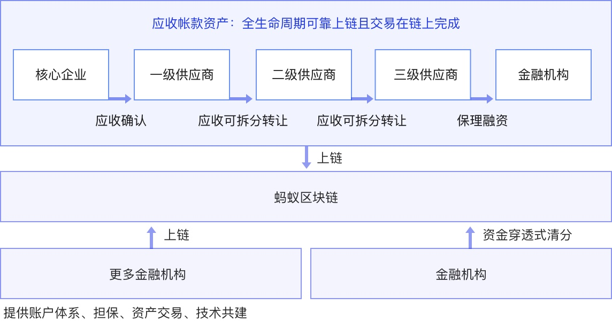
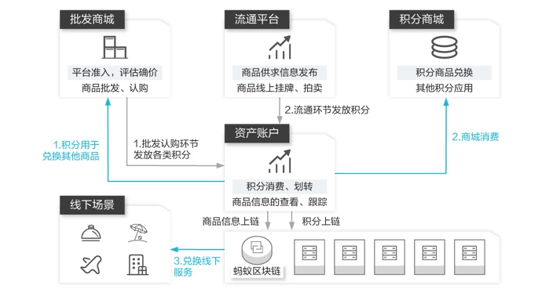
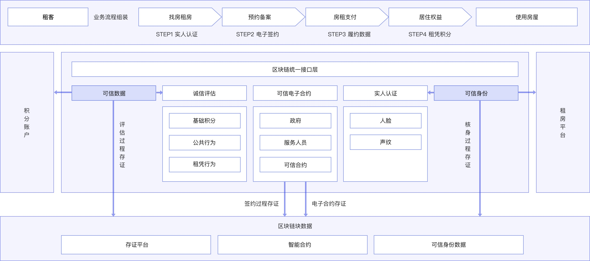
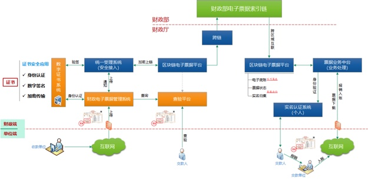
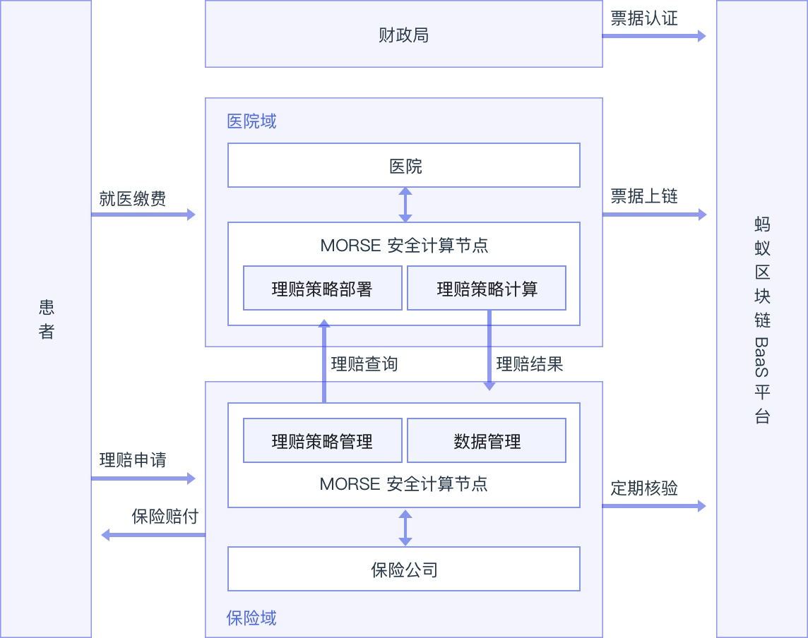
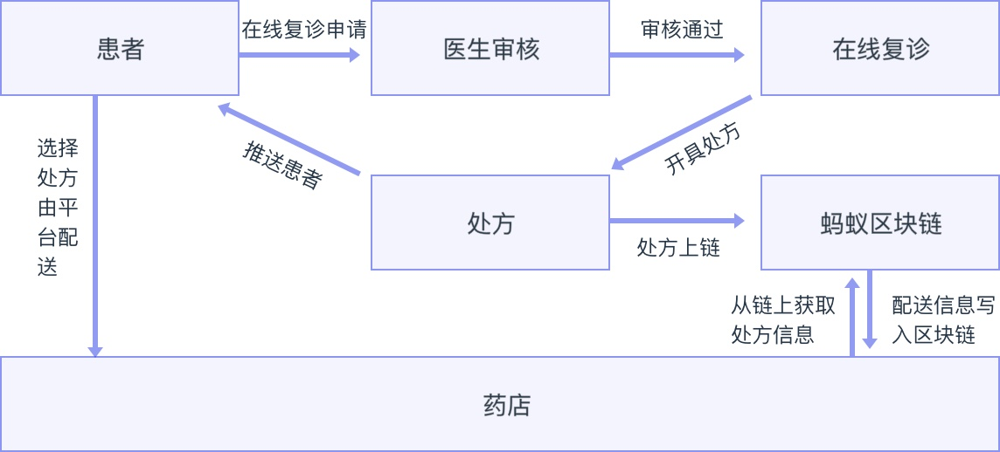
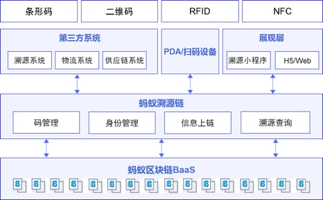
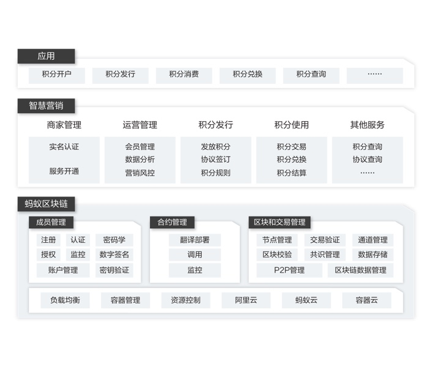
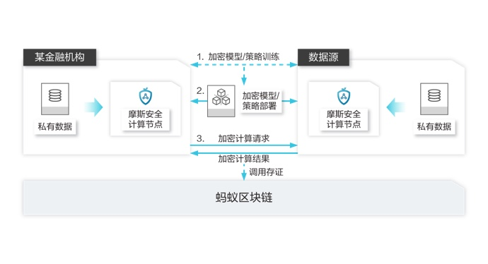
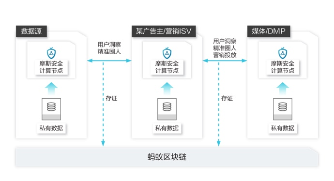

# 联盟链小白书

[Dily](https://dilyblog.com/) &copy; 2019

-----
# 蚂蚁区块链

## 解决方案

### 金融场景

#### 1.供应链金融

双链通平台以核心企业的应付账款为依托，以产业链上各参与方间的真实贸易为背景，使得核心企业的信用得以在平台内流动，使更多产业链上下游的小微企业获得平等高效的普惠金融服务。开放平台欢迎更多的核心企业、金融机构、合作伙伴加入，共建区块链+供应链的信任新生态。

##### 业务难点

* 小微企业融资难融资贵
传统的供应链金融实践通常只能服务到核心企业的直接上下游，供应链条上末端的小微企业较难触达，小微融资难融资贵问题突出。
* 金融机构操作风险及成本高
金融机构在贸易背景核实、可靠质权、回款控制等方面操作与风险成本均较高，而贸易链条中的企业或平台又难以自证，金融机构开展供应链金融业务的成本、风险和收益较难平衡。
* 核心企业参与度不足
金融机构开展供应链金融业务通常仅从金融风险与收益去切入，与企业自身供应链管理优化结合太少，甚至某些方面还形成打扰，造成核心企业参与意愿度低，业务较难开展。

##### 业务流程

通过蚂蚁区块链硬件隐私保护技术，确保多方参与的安全性、隔离性；基础服务集成支付宝核身与企业网银核身能力，通过网银U盾签名，确保交易可靠无纠纷确权；业务中台核心服务实现云化，更多联盟参与方可以直接通过简单API加入网络。

##### 总结

* 联盟链部署是单个行业单独部署么？还是直接部署在蚂蚁区块链上？
* 这个联盟链的源码在哪里？特性是什么？
* 目前有没有切实落地的项目？具体功能有哪些？
* 是否需要视频演示，而不是单纯的文字介绍？

#### 2.数字资产流转

利用区块链技术，使各类商品（包括但不限于农产品、文化艺术品、版权、知识产权、电子仓单等）上链形成数字资产，打通线上线下流转、消费场景。

##### 业务难点

* 解决信息阻塞，加速商品流通
利用蚂蚁金服自研区块链技术，解决商品流通环节的信息互通困难局面，加快商品流通效率。
* 构建更完善的多方信任机制
利用智能合约技术，解决参与者信任机制不完善现状，逐步形成数字资产链上、链下的信用体系。
* 提升资产交易、管理效率
形成多渠道、多终端、多商品品种的数字资产链上管理系统，促进商品流通性，形成最终商品消费。

##### 方案优势

* 商品真实锚定
* 商品信息实时跟踪
* 流通、消费场景便捷接入
* 金融服务快速接入

##### 业务流程

数字资产流转平台根据各类平台的业务需求，首先提取了商品批发、流转、零售消费的整个业务过程，形成线上的整个流通链路，并提供积分营销的辅助手段；通过商品信息和积分上链后，一方面方便买家完成商品信息的跟踪；另一方面接入到更多除了线上商城以外的场景完成最终消费。

##### 总结

* 商品上链的环节如何确保真实有效：对商品生产码签名生成唯一Hash
* 联盟链参与各方都是哪些？

#### 3.跨境汇款

2018 年 6 月，蚂蚁金服开通了第一条基于区块链的跨境通道，实现了香港和菲律宾之间秒级到帐的汇款体验。

### 生活场景

#### 1.智慧租房

基于区块链的智慧住房租赁平台，“以技术创新为依托，以标准引领为目标，以提升居民幸福感及满足感为己任”，打造具有全国示范作用及意义的住房服务管理体系。

##### 业务难点

* 运营规范难
大量的虚假房源充斥住房租赁市场，房源信息真伪难辨，出租运营权无法认定，出租房分期借贷纠纷众多。
* 风险把控难
对承租方来说，普遍存在租金价格不透明乱收费的现象、退房无法退押金现象。而对于出租方来说，承租方是否诚信，是否有交易风险或犯罪风险，是否有正当职业，这些权益保障也存在不同程度的缺失。
* 政府监管难
市场上出租承租双方私下签约现象普遍存在，这些交易没有经过网签备案，合同不规范导致漏洞较多，经常导致双方发生纠纷。

##### 业务流程

基于区块链的智慧住房租赁管理平台，引入区块链技术作为底层技术保障，搭建基于区块链技术的分布式房屋租约管理系统，产出房源信息、产权信息、合同信息、交易信息等租房管理业务体系。区块链底层平台对租赁及履约数据进行存证，保证数据公开、透明、不可篡改，数据全程加密处理及多级秘钥保证数据使用时达到最小粒度授权的特性，真正做到“我的数据我做主”。

##### 总结

* 房屋服务方是谁？他们在不在这个联盟链中？
* 有没有经纪人的业务逻辑？
* 房屋确权如何做？

#### 2.医疗电子票据

蚂蚁区块链电子票据，基于患者隐私保护实现多方安全应用。电子票据由监管财政统一验签后上链，由政府权威机构背书，保证了票源的可靠性和稳定性。通过区块链技术进行流转，解决了票据状态的一致性、患者的隐私保护、多方安全的应用等。

##### 业务难点

* 看病烦
就诊过程中打印票据增加用户排队等待时间，传统票据收纳不便等，已成为制约医疗改革的关键瓶颈。
* 报销慢
传统票据，医保零星报销需12个工作日，商保理赔需7至60天。患者等待时间长，材料反复补，群众满意度低。
* 监管难
大量的纸质票据给财政监管、医保监管、审计监督等带来了繁重的工作量，很难满足相关部门的监管需求。

##### 业务流程

* 接入优势
实现财政电子票据报销流程再造，降低整体社会应用成本，提高报销时效的同时，可与财政电子票据管理系统无缝对接。
* 统一接入服务
通过财政电子票据管理系统验签后统一上链，保障链上票据可信。
* 政务民生服务
医保中心、卫健委等政府机构用票服务，通过省数据共享平台，在政务网内运作。
* 社会化应用服务
商业保险、记账公司等社会化用票，用户实名认证后，授权用票单位从链上获取对应的电子票据进行报销入账。
* [全国首个区块链电子票据平台上线](http://jhyw.zjzwfw.gov.cn/art/2019/6/12/art_1180567_34597153.html)

##### 总结

* 患者数据上链信息是否加密：一票一密、数据不落盘
* 查看、报销入账等均需要用户实名认证授权应用
* 目前落地最好的应用

#### 3.医保快赔解决方案

通过引入区块链技术，将患者，医疗机构，保险机构，金融机构，监管机构链接起来，实现医疗保险理赔过程中的信息安全共享，流程自动高效和全过程监管。

##### 业务难点

* 纸质单据难保管，易丢失
传统的医疗理赔的方式，依赖大量的纸质单据。纸质单据难保管，易丢失，而且当需要在多家保险机构报销时，过程更加繁琐。
* 存在骗保可能性
保险和医疗系统没有打通，依赖原始单据做为理赔凭证，核实困难，存在骗保的情况。
* 效率低下
理赔过程都大量依赖人工的操作，效率低下，理赔的申请、受理、审核及赔付周期长而且很难杜绝人为的操作错误、行为疏漏，甚至是恶意篡改。

##### 业务流程

通过引入区块链技术，将患者，医疗机构，保险机构，金融机构，监管机构链接起来，实现医疗保险理赔过程中的信息安全共享，流程自动高效和全过程监管。

在区块链医疗保险理赔平台，患者在医疗机构就诊后，提出理赔申请，并授权医疗机构将相关就诊信息上链，信息上链后会触发与患者有参保关系的保险公司的理赔智能合约。智能合约按照事先约定好的理赔规则进行自动的处理，符合规则的理赔请求，将通知金融机构进行理赔资金划拨。所有在区块链上的参与方都经过证书中心的证书认证，确保身份真实可信。在区块链上提交的信息，经过相关方的授权，并且采取了高级的隐私保护手段（如，非对称加密，安全分享策略，零知识证明）保证信息防抵赖，防篡改，仅对相关方可见。

理赔智能合约的执行，保证了事先约定好的理赔规则得到切实的执行，无人为干扰，而且自动化的方式极大的提高了理赔的效率。在区块链上的医疗和保险的监管机构全过程可见证，提高监管的效率。

更进一步的，金融机构甚至可以在患者就诊环节中提供金融服务。患者凭借“信用”进行就医，减少患者的资金压力。就诊完成后，保险理赔资金通过智能合约直接划拨到患者在金融机构的帐户，实现保险直赔。

##### 总结

* 蚂蚁BaaS平台、医院、保险公司作为节点，但是大多数部署在蚂蚁BaaS平台上
* 之前的解决方案大多数依托于蚂蚁BaaS平台

#### 4.电子处方流转解决方案

蚂蚁区块链平台为处方流转构建了由医疗机构，药房，配送机构，支付机构，监管机构做为参与方的协作联盟，并良好的解决了处方在多机构流转过程中的信息的隐私保护，防篡改、状态及时同步、全程可追溯，信息可审计等。

##### 业务难点

* 信息的隐私保护
国务院和卫生主管部门明确提出了，医疗机构应该按照药品通用名开具处方，并主动向患者提供，患者可凭处方到零售药店购药，在此过程中的数据，需要进行隐私保护。
* 全程可被追溯
医院，药房，配送，支付，监管等多个参与方，围绕患者信息，处方信息，药品流通信息等，形成了协作联盟， 同时流通信息可被追溯。
* 流转过程中防止被篡改
电子处方流转是互联网医院运营的重要环节，用户如何能够在保障信息安全的前提下足不出户获得合适的医疗健康服务，同时也需要在处方流转过程中防止被篡改。

##### 业务流程

基于蚂蚁区块链的电子处方管理平台，医院、药店、配送平台、政府监管机构共同形成联盟链，用户通过支付宝发起在线复诊，医生通过钉钉等移动端审核后开出处方，由饿了么等配送平台上链获取处方订单后，前往药店取药配送到用户家中。

处方开出的那一刻起就开始“盖戳”，线上开药、线上配药、送药、签收药，都会被盖上一个“戳”。用户在这些“戳”不可篡改、全程可相互印证及追溯，患者可以放心收药，而不必再担心处方在流转过程中被篡改；处方的唯一性也得到保证，因为一张处方一旦被盖上已配送的“戳”后，就不能再次配药了。

##### 总结

* 医院、药店、配送平台、政府监管
* 业务流程图不准确

#### 5.版权

蚂蚁区块链版权保护平台，为作品内容生产机构或内容运营企业提供集原创登记、版权监测、电子数据采集与公证、司法维权诉讼为一体的一站式线上版权保护解决方案。

#### 6.公益慈善

2016 年下半年，蚂蚁金服联合中国红十字基金会等公益机构上线区块链试验项目，使捐款人可以追踪善款的完整流转情况。

### 零售场景

#### 1.溯源

利用蚂蚁区块链的技术能力，同时结合物联网技术，将商品从原材料采购，加工，生产，质检，物流，经销商，零售商一直到消费者手里全流程信息的可信记录，解决了信息孤岛，信息流转不畅，信息缺乏透明度等行业问题。

##### 业务难点

* 信息不对等以次充好
不法商贩利用商品链条中各个环节中的漏洞和信息不对称，制造假冒伪劣商品，以次充好，给国民经济、产品品牌、消费者都带来很大损害。
* 纠纷无法处理
一旦信息出现不利于自身的情况时，该环节主体很有可能篡改账本或者谎称信息由于某种原因丢失，甚至是抵赖，推卸责任，造成举证、追责困难，很多纠纷不了了之。
* 供应链效率低
不同环节的主体之间必然存在大量的交互和协作，由于信息不透明、不流畅导致链条上的各参与主体难以准确了解相关事项的状况及存在的问题，从而影响供应链的效率

##### 业务流程

利用区块链技术所特有的不可篡改，不可抵赖，易追溯的特点，结合物联网、防伪标签、物流跟踪等技术手段，可以有效防范供应链中各类鱼龙混杂和假冒的商品，在产生纠纷时，可以有效的实现追责。

具体的解决方案是通过防伪标签或者芯片等手段对商品进行唯一标识，将商品在原材料过程、生产过程、流通过程、营销等过程的信息，由各对应主体使用标明身份的“私钥”进行数字签名并附上时间戳写入区块链，一旦写入区块链即不可篡改。

消费者或者监管部门可以从区块链上查阅和验证到商品流转的全过程信息，从而实现精细到一物一码的全流程正品追溯。借助区块链技术，实现品牌商、渠道商、零售商、消费者、监管部门、第三方检测机构之间的信任共享，全面提升品牌、效率、体验、监管和供应链整体收益。

##### 总结

* 医院、药店、配送平台、政府监管
* 业务流程图不准确

#### 2.大宗商品区块链仓单

利用区块链及物联网技术追踪记录大宗商品仓单的全周期数据，确保数据真实有效且不可篡改，解决仓单数据流转不畅、造假等行业问题。

### 通用场景

#### 1.身份服务

一套基于区块链技术的分布式多中心的实体身份标识及可信数据交换的分布式数据身份服务，实现了一套符合 W3C DID 规范的分布式多中心身份标识协议，和符合 W3C VC 规范的可验证声明服务。可以便捷的对分布式身份数字进行创建、验证、

#### 2.数字化营销解决方案

通过互联网营销环节中的数字资产，风控认证，分销拉新等服务，结合区块链资产化、数字化的特性，对现有营销服务场景进行提升改造，结合现有热点提升营销效率。

##### 方案优势

* 轻松实现复杂分销
支持二级分销清算、结算，商户仅需调用简易接口，即可实现复杂的分佣规则计算
* 低成本营销对接
在数字资产（如，积分、虚拟权益）发行服务中，商户可无感知的向用户进行切换升级，同时商户发行的资产具备多场景使用兑换能力，降低商户营销对接成本
* 强大的风控技术
基于蚂蚁金服多年的营销风控沉淀，对刷单行为在多场景多维度的风险进行限制，提升活动质量和安全性

##### 业务流程

区块链数字化营销服务依托于蚂蚁自研BaaS服务平台，通过可插拔的独立组件向商户提供灵活的营销服务。目前支持区块链数字资产发行，链式分销，营销风控，数字身份验证等功能。并通过SaaS化平台，支持分销类活动搭建，佣金结算，用户关系管理等。

#### 3.联合风控

多家互联网金融机构建立基于多方安全计算技术的风控数据联盟，密态分享黑名单、信贷申请、信贷记录等数据项，分布式加密计算得到统计结果。在保证企业数

#### 4.物联网设备可信上链

有效地保障物联网设备采集数据的真实性，实现上链数据即为可信数据的目标。

#### 5.合同存证

基于蚂蚁区块链，提供高效、司法可信、轻量便捷的电子合同存证解决方案，保证合同真实不可篡改、具备司法效力、提高维权效率。

## 产品

### BaaS 平台

区块链 BaaS（Blockchain-as-a-Service）平台依托蚂蚁金服金融科技（简称“金融科技”）平台开放行业领先的金融科技区块链服务。提供简单易用，一键部署，快速验证，灵活可定制的区块链服务，加速区块链业务应用开发、测试、上线，助力各行业区块链商业应用场景落地。提供高性能，稳定可靠，隐私安全，多种类型数据的区块链存证能力。

#### 1.产品特性

* 公有许可机制
    * 面向广大开发者和中小微企业提供服务
    * 联盟参与方加入需经过许可，权威公正
    * 无需建链即可享受蚂蚁区块链服务
* 生态服务共建
    * 联盟用户均可参与服务设计与输出，共享生态收益
    * 开放联盟链提供阿里经济体流量、服务承接
* 优秀开发工具
    * Cloud IDE及**智能合约开发模板**
    * 多语言SDK集成服务
    * 功能强大、丰富多样的中间件
* 深厚基础能力
    * 支持分布式数字身份
    * 支持链上统一积分
    * 提供强大的隐私计算能力
    * 提供企业身份认证、实人认证、内容安全、金融级风控等能力

#### 2.产品优势

* 高性能
金融科技区块链基于全球领先的并行共识技术，轻松满足金融领域的高频场景应用。
* 高可靠性
业务可靠受理，峰值业务缓冲，基于 PBFT 的共识技术提供高可用的拜占庭容错能力，支持共识状态自动恢复，区块数据互备恢复，数据存储自动均衡，节点服务自动路由。
* 双重权限信任保护
提供双重权限信任保护。第一重，**联盟链的可信参与方对该联盟链可见，其它用户对该联盟链不可见**；第二重，参与联盟链须提交用户 CA 证书申请并等待审核，通过审核后方可参与联盟链操作。
* 跨网络部署
可以根据联盟参与方需求跨云平台部署区块链节点，即部分参与共识的节点运行在金融科技平台，部分参与共识的节点**运行在用户的 IT 环境**。
* 数据隐私及安全
用户可以选择明文数据上链，**也可以对称加密的方式对上链数据进行加密**。同时支持分享隐私模型，即将加密密钥通过另一把私密密钥加密，加密后的明文和加密后的密钥上链保存。私密密钥通过特定的密钥导出函数进行管理，根据不同安全级别和分享范围分享不同的私密密钥。
* 网络安全保障
多个独立的区块链节点部署在金融区的 VPC 网络中，保证网络安全性。同时，该 VPC 网络与用户在金融科技平台上的 VPC 可以连通，保证用户应用在安全的网络环境中访问操作区块链。
* 简单易用
减小区块链使用门槛，用户无需精通或掌握区块链底层技术细节，无需相关的资源环境运维投入，从而使用户专注于基于区块链技术的业务应用和场景的创新与开发。

#### 3.功能特性

蚂蚁金服金融科技区块链提供简单易用，一键部署，快速验证，灵活可定制的区块链服务。

* 创建联盟
用户可以在我的联盟页申请创建联盟，填入创建联盟的相关信息后，后台管理员会根据申请信息作出审批操作。通过，则创建联盟成功，在联盟页可看到已创建的联盟；不通过，联盟无法创建。
* 加入联盟
联盟内用户，可邀请其他机构的用户加入已经存在的联盟，已被邀请的用户，**待联盟内所有机构审批通过后**，即可成为联盟中的一员，如果有机构不通过，则无法加入联盟。
* 联盟链准入
用户可以通过上传证书请求，申请加入某联盟链。
* 证书与密钥
用户在本地生成证书请求和私钥后，需保管自己的私钥文件和密码。申请加入联盟链时，用户需上传证书请求，证书请求审核通过时，用户上传的证书请求将由 CA 中心签名。用户应下载签名后的证书，用户访问区块链须使用签名的证书请求和私钥。
* 自动化部署
区块链节点软件采用**自动化部署**方式，根据用户申请需求快速自动建立区块链平台。对于区块链节点软件版本更新，可后台各节点逐步升级，同时不影响区块链功能。
* 区块链平台
提供拜占庭容错的 3F+1 个独立区块链节点，运行蚂蚁金服自研的区块链软件。
* 区块链应用
用户可以在联盟内创建区块链应用，可将区块链应用发布到所处的联盟，联盟内所有机构共享联盟内的区块链应用。
* 区块链浏览器
可通过区块链浏览器查询交易数目，节点信息、最近出块信息、块中包含的交易信息、区块信息查询、交易信息。

### 多方安全计算平台

蚂蚁摩斯（ANT MORSE ）为了数据流动的价值，利用多方安全计算、隐私保护、区块链打造数据安全共享的基础设施。解决企业之间数据合作过程中的数据安全和隐私保护问题，打通数据孤岛，将计算移动到数据端，达成数据可用不可见，安全促进业务创新。

#### 1.方案优势

* 透明可信
利用蚂蚁区块链将数据交互存证，可追溯可审计。蚂蚁摩斯安全计算拥有 40 多项专利，并获得国内外多项权威安全认证，参与并主导中国信通院多方安全计算标准制定。
* 去中心化架构
采用完全分布式的架构，对数据加密，计算和交互在加密后数据的多个计算节点之间独立完成，无中心控制节点，具备更强容灾与防攻击能力
* 合规与隐私保护
保证数据最小化利用，所有计算均在加密或脱敏之后进行计算，最大程度的保障个人隐私数据安全

#### 2.业务流程

##### 联合风控

金融机构通过蚂蚁摩斯安全计算节点连接合规优质数据源，进行安全模型训练、测试验证数据效果、一键远程模型部署。同时可通过摩斯进行模型结果和变量监控，便于及时发现问题， 优化模型。具备安全、便捷、一站式接入等优势。

##### 联合营销

金融机构可以通过蚂蚁摩斯与第三方数据源、媒体建立安全和保护隐私的数据连接，结合多方数据进行安全用户碰撞、联合客群画像、建立预测模型，精准定位目标客群，通过优质媒体进行投放，提升转化，降低成本。

### 可信存证平台

具备全链路可信，司法权威节点见证，安全隐私保护，一站式接入能力，全国首家法院认可的区块链存证平台。

#### 1.方案优势

* 司法权威节点见证
数据采用分布式账本保存，由联盟节点包括钱塘公证处，上海市计算机行业协会司法鉴定所，杭州互联网法院等权威节点共同见证
* 真实保障不可篡改
采用完全分布式的架构，对数据加密，计算和交互在加密后数据的多个计算节点之间独立完成，无中心控制节点，真实保障不可篡改
* 合规与隐私保护
保证数据最小化利用，所有计算均在加密或脱敏之后进行计算，最大程度的保障个人隐私数据安全

#### 2.业务场景

* 数字作品登记场景
互联网时代信息传播极快，没有预先登记的情况下，数字作品被侵权的概率很高，而且维权成本很高，蚂蚁可信存证服务提供了数字作品，包括图片，视频，音频，文字，代码等数字作品的所有权登记服务，让原创作品快速生成司法认可的电子数据存证证明，保护数字作品版权。
* 服务须知存证场景
互联网服务大量纠纷在于平台和商家是否就服务限制性条件提前明确告知用户，包括限制性条件，使用范围，服务协议，隐私保护条款等，蚂蚁可信存证服务提供了具备可信时间戳，公正中立，司法认可的服务须知存证服务，帮助商家或者用户维护自己合法权益。
* 电子凭证存证场景
电子证明，交易凭证，电子合同，电子票据等数据凭证等不容易管理，容易遗失，很难流通，很难验真等，蚂蚁可信存证可以为你的电子凭证提供永久性存证，验证服务，不仅方便你的管理，更让你的凭证易于流通。
* 在线交易存证场景
网络购物行为，交易行为存在大量的细节性数据，随着时间的推移这些数据会容易遗失，当产生纠纷时就很难串接起来，蚂蚁可信存证为你的在线交易提供公正客观司法认可的存证服务，为你的线上数据行为提供双保险。
* 侵权维权存证场景
当你的合法权益受到侵犯时，蚂蚁可信存证为你提供了侵权证据的存证服务，如侵权网站的服务条款，服务内容，交易价格，客服沟通记录等，保障你的合法权益。

#### 3.总结

* 如何具体使用
* 案例详细介绍

### 溯源平台

蚂蚁区块链溯源服务（ Ant Blockchain Traceability As a Service，简称 "TaaS" ）利用区块链和物联网技术追踪记录有形商品或无形信息的流转链条，把商品的品质信息、物流信息、质检信息等关于商品特征的数据，不可篡改的登记在区块链上，解决了信息孤岛，信息流转不畅，信息缺乏透明度等行业问题。

#### 1.方案优势

* “2B2C”的双端服务模式
为品牌企业用户提供“2B2C”的双端（TaaS平台端和支付宝小程序端）服务模式。通过TaaS平台端，企业用户可以定制商品的溯源环节和溯源信息，实现区块链技术的快速赋能；通过支付宝小程序端，企业用户可以定制对外露出的品牌元素，让品牌的终端用户迅速了解商品并查验溯源信息，实现品牌心智打造和精准客群获取。
* 一站式极速接入体验
TaaS平台提供简单易用的流程和多样化的接入形式，无需IT研发能力也能快速对接使用。品牌企业用户可以按需选择直接使用TaaS管理平台或者使用API接口形式来对商品溯源信息进行配置和管理，从而实现“一分钟开通、三分钟配置、五分钟发布”的一站式极速接入。
* “溯源+营销”双剑合璧
TaaS平台除了提供基础的区块链溯源服务外，还给品牌企业用户提供了丰富的营销能力，包括但不限于支付宝基础权益提供、异业权益导流、营销反欺诈能力、品牌权益发放与营销活动管理，从而实现售前、售中、售后的全方位营销管理。

#### 2.业务场景

* 农产品（食品）溯源
从农产品生产、加工、运输、仓储、销售等全链路环节进行可信溯源，保障消费者权益。
* 跨境商品溯源
从海外生产企业开始，记录单品和生产批次的对应关系，经历海外质检机构抽样和监督、海外入仓、干线物流、国内质检、运输直到消费者手里，全程信息上链，保证跨境商品的可追溯。
* 农资、农药溯源
为农资农药赋予唯一区块链电子身份证，把人、机、物进行有效关联记录，利用先进物联网技术和工具实现全程溯源，能够有效打击“窜货、假冒”现象，保护农民的利益。
* 化妆品溯源
对化妆品的整个生产链进行统一管理，通过一物一码并结合区块链技术，能让消费者了解化妆品的前世今生，增加消费者粘性，提升产品销量。
* 艺术工艺品溯源
具有高价值的艺术工艺品往往具有被仿冒的风险，需要专业权威的鉴定机构进行鉴定，通过蚂蚁溯源链，可以将工艺品的特征信息、鉴定信息进行不可篡改的可信记录，实现来可追，去可查。
* 二手商品溯源
针对消费者对二手商品强烈的溯源验真需求，可以将商品出厂的溯源信息、购买信息、租借、回收、维修等信息全部上链，加强消费者对二手商品的信任感，加速二手市场的发展。

#### 3.总结

* 如何具体使用
* 案例详细介绍

## 其他

* 可信执行环境
Trusted execution environment
可信执行环境(TEE) 是Global Platform(GP)提出的概念。 是移动设备主处理器上的一个安全区域，其可以保证加载到该环境内部的代码和数据的安全性、机密性以及完整性。
* 图灵完备
一切可计算的问题都能计算，这样的虚拟机或者编程语言就叫图灵完备
* 蚂蚁区块链
是部署在蚂蚁的统一区块链上，还是针对不同的细分业务单独部署

